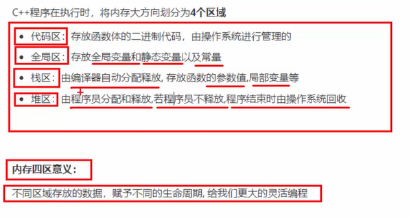
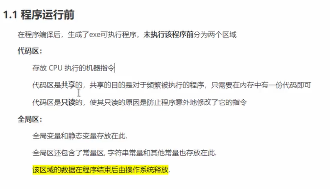
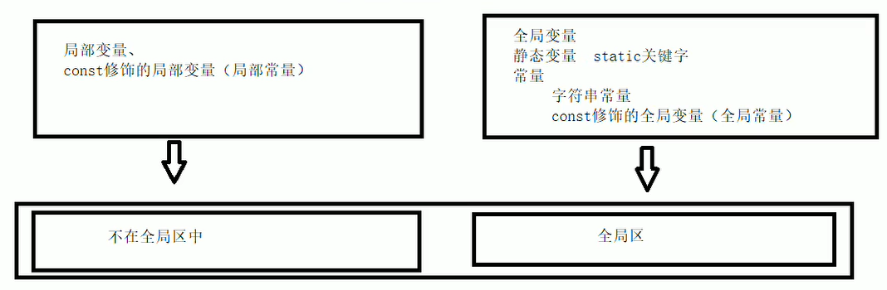
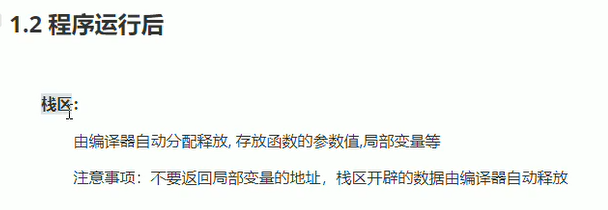
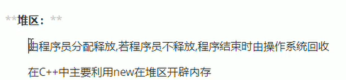
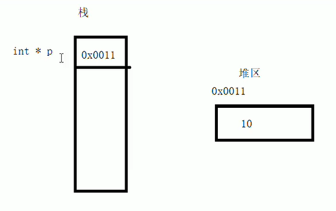

## 内存模型4个区



```cpp
#include <iostream>
using namespace std;

//全局变量
int g_a = 10;
int g_b = 10;

//const修饰的全局变量，即全局常量
const int c_g_a = 10;
const int c_g_b = 10;

int main()
{
    //全局区

    //全局变量、静态变量、常量

    //创建普通局部变量
    int a = 10;
    int b = 10;
    cout << "局部变量a的地址：" << (long long int)&a << endl;
    cout << "局部变量b的地址：" << (long long int)&b << endl;
    
    cout << "全局变量g_a的地址：" << (long long int)&g_a << endl;
    cout << "全局变量g_b的地址：" << (long long int)&g_b << endl;

    //静态变量
    static int s_a = 10;
    static int s_b = 10;
    cout << "静态变量s_a的地址" << (long long int)&s_a << endl;
    cout << "静态变量s_b的地址：" << (long long int)&s_b << endl;

    //局部常量
    //1.字符串常量
    cout << "字符串常量的地址：" << (long long int)&"hello world" << endl;

    //2.const修饰的变量

    //2.1 const修饰的全局变量
    cout << "const修饰的全局变量，即全局常量c_g_a的地址：" << (long long int)&c_g_a << endl;
    cout << "const修饰的全局变量，即全局常量c_g_b的地址：" << (long long int)&c_g_b << endl;

    //2.2 cosnt修饰的局部变量，即局部常量
    const int c_l_a = 10;
    const int c_l_b = 10;

    cout << "cosnt修饰的局部变量，即局部常量c_l_a的地址："<< (long long int)&c_l_a << endl;
    cout << "cosnt修饰的局部变量，即局部常量c_l_b的地址："<< (long long int)&c_l_b << endl;
}
```
输出：
```
局部变量a的地址：6422044
局部变量b的地址：6422040
全局变量g_a的地址：4206608
全局变量g_b的地址：4206612
静态变量s_a的地址4206616
静态变量s_b的地址：4206620
字符串常量的地址：4210889
const修饰的全局变量，即全局常量c_g_a的地址：4210692
const修饰的全局变量，即全局常量c_g_b的地址：4210696
cosnt修饰的局部变量，即局部常量c_l_a的地址：6422036
cosnt修饰的局部变量，即局部常量c_l_b的地址：6422032
```





比如下面的代码会报警：
```cpp
#include <iostream>
using namespace std;

int *func()
{
    int a=10;//局部变量，存放在栈区
    return &a;//返回局部变量的地址
}
int main()
{
    int *p=func();
    cout<<*p<<endl;
}
```

输出：
```
stack.cpp:6:9: warning: address of local variable 'a' returned [-Wreturn-local-addr]
```



```cpp
#include <iostream>
using namespace std;

int *func()
{
    //利用new关键字，可以在堆区开辟数据
    int *p=new int(10);
    return p;
}
int main()
{
    //在堆区开辟数据
    int *p=func();
    cout<<*p<<endl;//10
    cout<<*p<<endl;//10
    cout<<*p<<endl;//10
}
```

图示：


## new 运算符
```cpp
#include <iostream>
using namespace std;
int *func()
{
    //在堆区创建一个整型的数据
    //new返回的是该数据类型的指针
    int *p=new int(10);
    return p;
}

void test01()
{
    int *p=func();
    cout<<*p<<endl;
    cout<<*p<<endl;
    cout<<*p<<endl;
    delete p;//释放内存
    cout<<*p<<endl;
}

void test02()
{
    //创建一个数组，数组中有10个元素
    int *arr=new int[10];
    for (int i=0;i<10;i++)
    {
        arr[i]=i+100;//给0个元素赋值
    }
    for (int i=0;i<10;i++)
    {
        cout<<arr[i]<<endl;//给0个元素赋值
    }
    delete[] arr;//释放数组内存
}
int main()
{
    test01();
    /*
    10
    10
    10
    38941856//内存已经被释放了，再次运行是错的
    */

    test02();
    /*
    100
    101
    102
    103
    104
    105
    106
    107
    108
    109
    */
}
```
