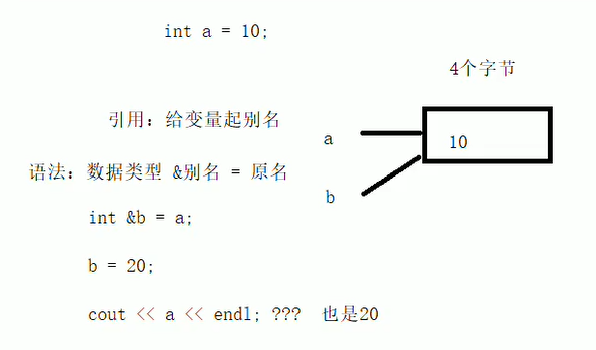
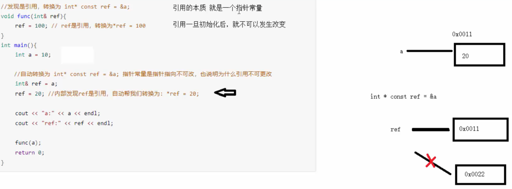

## 引用的基本语法
 作用：给变量起别名

 语法： 数据类型 &别名=原名;



```cpp
#include <iostream>
using namespace std;

int main()
{
    int a=6;
    //创建引用
    int &b=a;//给a起个别名叫做b
    cout<<a<<b;//6 6
    b=7;
    cout<<a<<b;//7 7
}
```
## 引用的注意事项
- 引用必须初始化，比如int&b;这种是不合法的
- 引用一旦初始化，就不能更改成其余变量的别名了

```cpp
#include <iostream>
using namespace std;

int main()
{
    int a=6;
    //创建引用
    //int &b;//出错：yinyong.cpp:8:10: error: 'b' declared as reference but not initialized
    int &b=a;
    int c=8;
    b=c;//赋值操作，而不是更改引用
    cout<<a<<b<<c<<endl;//8 8 8
}
```
## 将引用作为函数的参数
作用：函数传参时，可以利用引用的技术让形参修饰实参

优点：可以简化指针修改实参
```cpp
#include <iostream>
using namespace std;

//值传递
void swap0(int a,int b)
{
    int temp=a;
    a=b;
    b=temp;
}
//地址传递
void swap1(int *a,int *b)
{
    int temp=*a;
    *a=*b;
    *b=temp;
}
//引用传递
void swap3(int  &a,int &b)//对传入的a和b起了个别名叫做a，b，因此能够修改
{
    int temp=a;
    a=b;
    b=temp;   
}
int main()
{
    //值传递
    int a=10,b=20;
    swap0(a,b);
    cout<<"值传递："<<a<<" "<<b<<endl;//未改变：10 20

    //地址传递
    int c=10,d=20;
    swap1(&c,&d);
    cout<<"地址传递："<<c<<" "<<d<<endl;//改变：20 10

    //引用传递
    int e=10,f=20;
    swap3(e,f);
    cout<<"引用传递："<<c<<" "<<d<<endl;//改变：20 10
}
```
输出：
```
值传递：10 20
地址传递：20 10
引用传递：20 10
```

> 对比：地址传递传进函数的是地址，引用传递传进函数的是变量的别名（更简单些）

## 将引用作为函数的返回值
注意：
- 不要返回局部变量的引用
- 函数的调用可以作为左值

```cpp
#include <iostream>
using namespace std;

//不要返回局部变量的引用
int &test0()
{
    int a=10;//局部变量存放在四区中的栈区
    return a;
}
//函数的调用可以作为左值
int &test1()
{
    static int a=10;//静态变量，存放在全局区，全局区上的数据在程序结束后系统释放
    return a;
}
int  main()
{
    //不要返回局部变量的引用
    //int &ref=test0();//warning: reference to local variable 'a' returned
    
    //函数的调用可以作为左值
    int &ref=test1();
    cout<<ref<<endl;//10

    test1()=1000;//等价于a=1000; 此即：函数的调用可以作为左值
    cout<<ref<<endl;//1000，因为ref就是a的一个别名
}
```
## 引用的本质
本质：引用的本质在C++内部实现是一个指针常量



## 常量引用
作用：常量引用主要用来修饰形参，防止误操作

在函数形参列表中，可以加const修饰形参，防止形参改变实参
```cpp
#include <iostream>
using namespace std;

void showValue(int &val)
{
    val=1000;//修改传入
    cout<<val<<endl;
}
int main()
{
    //int &ref=10;//非法！引用必须引一块合法的内存空间
    const int &ref=10;//加上const后，编译器将代码修改为int temp=10;const int &ref=temp; 这是合法的
    //ref=20;//非法！加上const之后，变为只读，不可以修改

    int a=100;
    showValue(a);//100 
    cout<<a<<endl;//1000，被修改了
}
```
在showValue中修改了val

为了防止被修改，可以给showValue传入const类型：
```cpp
#include <iostream>
using namespace std;

void showValue(const int &val)
{
    //val=1000;//加了cosnt后，这句就非法了
    cout<<val<<endl;
}
int main()
{
    //int &ref=10;//非法！引用必须引一块合法的内存空间
    const int &ref=10;//加上const后，编译器将代码修改为int temp=10;const int &ref=temp; 这是合法的
    //ref=20;//非法！加上const之后，变为只读，不可以修改

    int a=100;
    showValue(a);//100 
    cout<<a<<endl;//100
}
```