## 类的概念
类的语法：class 类名{访问权限：属性/行为};

一些别的名字：

属性：成员属性 成员变量

行为：成员函数 成员方法

一个简单的demo：
```cpp
#include <iostream>
using namespace std;

//设计一个圆类，求圆的周长
//圆的周长公式：2*pi*r
const double PI = 3.14; //圆周率

class Circle
{
    //访问权限
public: //公共权限
    //属性
    int m_radius;//半径
    //行为
    double calculate()//计算圆的周长
    {
        return 2*PI*m_radius;
    }
};

int main()
{
    Circle circle;//通过类创建一个具体的对象
    circle.m_radius =10;//半径赋值为10
    cout<<"圆的周长为"<<circle.calculate()<<endl;//圆的周长为62.8
}
```
再来一个demo：
```cpp
#include <iostream>
#include <string>
using namespace std;

class Student
{
public:

    string m_name;
    int m_id;

    void showStudent()
    {
        cout<<"姓名："<<m_name<<"学号:"<<m_id<<endl;
    }
    void set_name(string name)
    {
        m_name = name;
    }
};

int main()
{
    Student s1;
    s1.m_name="Bob";
    s1.m_id=1;
    s1.showStudent();//姓名：Bob学号:1

    Student s2;
    s2.m_name="Marry";
    s2.m_id=2;
    s2.showStudent();//姓名：Marry学号:2

    s2.m_name="heheda";
    s2.showStudent();//姓名：heheda学号:2
}
```
## 类的权限
- 公共权限：public        成员类内可以访问，类外也可以访问
- 保护权限：protected     只能在类内访问  子类可以访问父类中的(保护)内容
- 私有权限：private       只能在类内访问  子类不能访问父类中的(私有)内容

```cpp
#include <iostream>
#include<string>
using namespace std;
class Person
{
public:
    string m_name;
    string m_id;
protected:
    string m_car;
private:
    string m_password;

public:
    void func()
    {
        m_name="Bob";
        m_car="bike";
        m_password="123456";
        m_id="qwertyuio";
    }

};
int main()
{
    Person p1;

    p1.m_name="heheda";
    p1.m_id="cchdhddjjdjdjsjd";
    //p1.m_car="plane";//保护权限内容，类外访问不到
    //p1.m_password="76543";//私有权限内容，类外访问不到
    p1.func();
    cout << p1.m_id<<endl;//qwertyuio
}
```

## class 和 struct 的区别

两者默认的访问权限不同：
- struct：默认权限是public
- class：默认权限是private

```cpp
#include <iostream>
using namespace std;
class C1
{
    int m_A;//默认权限是私有private
};
struct C2
{
    int m_A;//默认权限是公共public
};
int main()
{
    C1 c1;
    //c1.m_A=100;//报错，类外不能访问

    C2 c2;
    c2.m_A=100;//
}
```

## 成员属性私有化
优点：
- 可以自己控制读写的权限
- 对于写，可以检测数据的有效性

提供一些公共的接口来操作(访问、修改等)这些属性
```cpp
#include <iostream>
#include <string>
using namespace std;

class Person
{
public:
    //设置姓名
    void set_name(string name)
    {
        m_name=name;
    }
    //获取姓名
    string get_name()
    {
        return m_name;
    }
private:
    string m_name;
    string m_age;
    string m_lover;
};

int main()
{
    Person p;
    p.set_name ( "Lucy");
    cout<<p.get_name()<<endl;//Lucy
}
```

## 构造函数和析构函数
构造函数：主要作用在于创建对象时为对象的成员属性赋值，构造函数由编译器自动调用，无需手动调用

析构函数：主要作用在于对象销毁前系统自动调用，执行一些清理工作

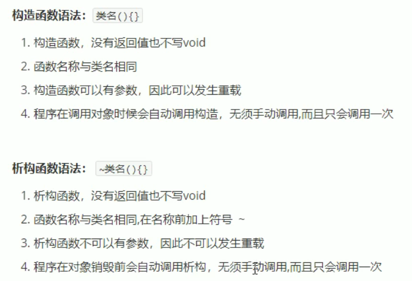

```cpp
#include <iostream>
using namespace std;

class Person
{
public:
    //1.构造函数
    //没有返回值
    // 函数名与类名相同
    // 构造函数可以有参数，可以发生重载
    // 创建对象时，构造函数会自动调用，而且只调用一次
    Person()
    {
        cout<<"Person构造函数的调用"<<endl;
    }

    // 2.析构函数
    // 没有返回值，不写void
    // 函数名和类名相同，在名称前要加~
    // 析构函数不可以有参数，不可以发生重载
    // 对象在销毁前，会自动调用析构函数，而且只调用一次
    ~Person()
    {
        cout<<"Person析构函数的调用"<<endl;
    }
};

//构造和析构都是必须有的实现，如果自己不实现，编译器会提供一个空实现的析构和构造函数
void test01()
{
    Person p;
}

int main()
{
    test01();//Person构造函数的调用
}
```
输出：
```
Person构造函数的调用
Person析构函数的调用
```

构造函数就好像Python中的__init__，在创建一个类的对象时会自动调用

## 构造函数的分类和调用

两种分类方式：

按参数分为：有参构造和无参构造

按类型分为：普通构造和拷贝构造

三种调用方式：

括号法、显示法、隐式转换法

```cpp
#include <iostream>
using namespace std;

class Person
{
public:
    //普通构造

    //无参构造
    Person()
    {
        cout<<"Person的无参构造函数的调用"<<endl;
    }
    //有参构造
    Person(int a)
    {
        age=a;
        cout<<"Person的有参构造函数的调用"<<endl;
    }

    //拷贝构造函数:将一个对象中的所有属性复制给自己一份
    Person(const Person &p)
    {
        cout<<"Person的拷贝构造函数的调用"<<endl;
        age=p.age;
    }

    ~Person()
    {
        cout<<"Person析构函数的调用"<<endl;
    }

    int age;
};

//构造函数的调用
void test01()
{
    //1.括号法
    Person p1;//默认(无参)构造函数的调用
    Person p2(10);//有参构造函数的调用
    Person p3(p2);//拷贝构造函数的调用
    cout<<"p2的年龄为："<<p2.age<<endl;//10
    cout<<"p3的年龄为："<<p3.age<<endl;//10

    //注意：在进行默认规则时，不要加()，一位内编译器会把它当成函数声明

    //2.显示法，有点像Python，只是前面需要加类名Person，就像定义变量时需要指定数据类型一样
    Person p4;//无参构造
    Person p5=Person(10);//有参构造 
    Person p6=Person(p5);//拷贝构造

    Person(10);//匿名对象，即上面等号的右侧。当前执行结束后，系统会立即回收掉匿名对象(运行可以看到，析构函数被调用后才打印下面的句子)
    cout<<"匿名对象执行"<<endl;

    //注意：不要使用拷贝构造函数初始化匿名对象
    //因为编译器会认为Person(p6) <==> Person p6; 对象声明重复了
    //Person(p6);

    //3. 隐式转换法
    Person p7=10;//相当于Person p7=Person(10),有参构造
    Person p8=p7;//拷贝构造

    

}
int main()
{
    test01();
}
```
输出：
```cpp
Person的无参构造函数的调用
Person的有参构造函数的调用
Person的拷贝构造函数的调用
p2的年龄为：10
p3的年龄为：10
Person的无参构造函数的调用
Person的有参构造函数的调用
Person的拷贝构造函数的调用
Person的有参构造函数的调用
Person析构函数的调用
匿名对象执行
Person的有参构造函数的调用
Person的拷贝构造函数的调用
Person析构函数的调用
Person析构函数的调用
Person析构函数的调用
Person析构函数的调用
Person析构函数的调用
Person析构函数的调用
Person析构函数的调用
Person析构函数的调用
```

## 拷贝构造函数的调用时机
1. 使用一个已经创建完毕的对象来初始化一个新对象
2. 值传递的方式给函数参数传值
3. 值方式返回局部对象

```cpp
#include <iostream>
#include <string>
using namespace std;

class Person
{
public:
    Person()
    {
        cout<<"Person默认（无参）构造函数调用"<<endl;
    }

    Person(int age)
    {
        cout<<"Person有参构造函数调用"<<endl;   
        m_age = age;
    }
    Person(const Person& p)
    {
        cout <<"Person拷贝构造函数调用"<<endl;
        m_age = p.m_age;
    }
    int m_age;

    ~Person()
    {
        cout<<"Person析构函数的调用"<<endl;
    }
};

//1.使用一个已经创建完毕的对象来初始化一个新对象
void test01()
{
    Person p1(20);//Person有参构造函数调用
    Person p2(p1);//Person拷贝构造函数调用
    cout<<"p2的年龄:"<<p2.m_age<<endl;//p2的年龄:20
}
//2. 值传递的方式给函数参数传值(拷贝一个新的临时副本出来)
void doWork(Person p)
{

}
void test02()
{
    Person p;//Person默认（无参）构造函数调用
    doWork(p); //Person拷贝构造函数调用
}

//3.值方式返回局部对象
Person doWork2()
{
    Person p1;
    cout<<(int*)&p1<<endl;
    return p1;
}
void test03()
{
    Person p=doWork2();
    cout<<(int*)&p<<endl;
}
int main()
{
    test01();//1.使用一个已经创建完毕的对象来初始化一个新对象
    test02();//2.值传递的方式给函数参数传值(拷贝一个新的临时副本出来)
    test03();//3.值方式返回局部对象
}
```
输出：
```
Person有参构造函数调用
Person拷贝构造函数调用
p2的年龄:20
Person析构函数的调用
Person析构函数的调用
Person默认（无参）构造函数调用
Person拷贝构造函数调用
Person析构函数的调用
Person析构函数的调用
Person默认（无参）构造函数调用
0x61fddc
0x61fddc
Person析构函数的调用
```
## 构造函数的调用规则
默认情况下，C++编译器至少给一个类添加3个函数：
- 默认构造函数(无参，函数体为空)
- 默认析构函数(无参，函数体为空)
- 默认拷贝构造函数，对属性值进行拷贝

规则：
- 如果用户定义有参构造函数，C++将不再提供默认无参构造函数，但是会提供默认拷贝构造
- 如果用户定义拷贝构造函数，C++不会再提供其他构造函数

用户定义拷贝构造函数:
```cpp
#include <iostream>
using namespace std;
class Person
{
public:
    //无参构造函数
    Person()
    {
        cout<<"Person的默认构造函数调用"<<endl;
    }
    //有参构造函数
    Person(int age)
    {
        cout<<"Person的有参构造函数调用"<<endl;
        m_age = age;

    }
    //拷贝构造函数
    Person(const Person&p)
    {
        cout<<"Person的拷贝构造函数调用"<<endl;
        m_age=p.m_age;
    }
    int m_age;

    //默认析构函数
    ~Person()
    {
        cout<<"Person的默认析构函数调用"<<endl;
    }
};

void test01()
{
    Person p;//Person的默认构造函数调用
    p.m_age=18;

    Person p2(p);//Person的拷贝构造函数调用
    cout<<"p2的年龄："<<p2.m_age<<endl;//p2的年龄：18
}
int main()
{
    test01();
}
```
用户未定义拷贝构造函数：
```cpp
#include <iostream>
using namespace std;
class Person
{
public:
    //无参构造函数
    Person()
    {
        cout<<"Person的默认构造函数调用"<<endl;
    }
    //有参构造函数
    Person(int age)
    {
        cout<<"Person的有参构造函数调用"<<endl;
        m_age = age;

    }
    // //拷贝构造函数
    // Person(const Person&p)
    // {
    //     cout<<"Person的拷贝构造函数调用"<<endl;
    //     m_age=p.m_age;
    // }
    int m_age;

    //默认析构函数
    ~Person()
    {
        cout<<"Person的默认析构函数调用"<<endl;
    }
};

void test01()
{
    Person p;//Person的默认构造函数调用
    p.m_age=18;

    Person p2(p);
    cout<<"p2的年龄："<<p2.m_age<<endl;//p2的年龄：18
}
int main()
{
    test01();
}
```
看，当用户没有定义拷贝函数时，C++会提供默认拷贝构造，将p的所有属性值拷贝一份给p2

如果用户定义有参构造函数，C++将不再提供默认无参构造函数，但是会提供默认拷贝构造:
```cpp
#include <iostream>
using namespace std;
class Person
{
public:
    //有参构造函数
    Person(int age)
    {
        cout<<"Person的有参构造函数调用"<<endl;
        m_age = age;

    }
    int m_age;

    //默认析构函数
    ~Person()
    {
        cout<<"Person的默认析构函数调用"<<endl;
    }
};

void test02()
{
    Person p(28);//Person的有参构造函数调用
    cout<<"p的年龄："<<p.m_age<<endl;//p2的年龄：28
}
int main()
{
    test02();
}
```
## 深拷贝和浅拷贝

深拷贝：在堆区程序申请空间，进行拷贝操作

浅拷贝：简单的拷贝操作

如果利用编译器提供的拷贝构造函数，会做浅拷贝

浅拷贝带来的问题：堆区内存的重复释放

下面的代码中，p1和p2的m_height都指向了同一块内存，根据栈后进先出的特性，这块内存首先会被p2释放，然后p1也来释放，发现找不到了


```cpp
#include <iostream>
using namespace std;

class Person
{
public:
    //默认(无参)构造函数
    Person()
    {
        cout<<"Person的默认构造函数调用"<<endl;
    }
    //有参构造函数
    Person(int age,int height)
    {
        cout<<"Person的默认有参函数调用"<<endl;
        m_age=age;
        m_height=new int(height);
    }
    int m_age;
    int *m_height;//指针，将数据创建在堆区

    //析构函数
    ~Person()
    {
        //析构代码，将堆区开辟的数据进行手动释放
        if(m_height!=NULL)
        {
            delete m_height;
            m_height = NULL;
        }
        cout<<"Person的析构函数调用"<<endl;
    }
};
void test01()
{
    Person p1(19,180);
    cout<<"p1的年龄："<<p1.m_age<<"身高为:"<<*p1.m_height<<endl;//p1的年龄：19身高为:180

    Person p2(p1);
    cout<<"p2的年龄："<<p2.m_age<<"身高为:"<<*p2.m_height<<endl;//p1的年龄：19身高为:180
    
}
int main()
{
    test01();
}
```
VS中报错

虽然在VSCode不报错，但p1似乎没有调用到析构函数。析构函数中不加if和加if对比如下：
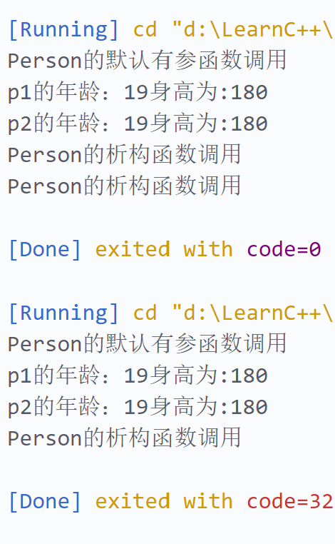

可以看到，析构函数中加if后少了一次析构函数的调用。

深拷贝可以解决这个问题！

只需重新申请一块内存

可以自定义拷贝函数，在里面实现这一操作：

```cpp
#include <iostream>
using namespace std;

class Person
{
public:
    //默认(无参)构造函数
    Person()
    {
        cout<<"Person的默认构造函数调用"<<endl;
    }
    //有参构造函数
    Person(int age,int height)
    {
        cout<<"Person的默认有参函数调用"<<endl;
        m_age=age;
        m_height=new int(height);
    }
    int m_age;
    int *m_height;//指针，将数据创建在堆区

    //自定义拷贝构造函数
    Person(const Person &p)
    {
        cout<<"Person拷贝构造函数的调用"<<endl;
        m_age=p.m_age;
        //m_height=p.m_height;//编译器默认实现的就是这个，这属于浅拷贝

        //改成深拷贝
        m_height=new int(*p.m_height);

    }
    //析构函数
    ~Person()
    {
        //析构代码，将堆区开辟的数据进行释放
        if(m_height!=NULL)
        {
            delete m_height;
            m_height = NULL;
        }
        cout<<"Person的析构函数调用"<<endl;
    }
};
void test01()
{
    Person p1(19,180);
    cout<<"p1的年龄："<<p1.m_age<<"身高为:"<<*p1.m_height<<endl;//p1的年龄：19身高为:180

    Person p2(p1);
    cout<<"p2的年龄："<<p2.m_age<<"身高为:"<<*p2.m_height<<endl;//p1的年龄：19身高为:180
    
}
int main()
{
    test01();
}
```

此时p1和p2都会调用析构函数了：
```
Person的默认有参函数调用
p1的年龄：19身高为:180
Person拷贝构造函数的调用
p2的年龄：19身高为:180
Person的析构函数调用
Person的析构函数调用
```

总结：如果属性有在堆区开辟的，一定要自己提供拷贝构造函数，防止浅拷贝带来的问题。

## 初始化列表
作用：C++提供了初始化列表的语法，用来初始化属性

语法：构造函数():属性1(值1), 属性2(值2),属性3(值3),...{};

1. 传统初始化操作:需要先定义变量再赋值
```cpp
#include <iostream>
using namespace std;

class Person
{
public:
    //传统初始化操作
    Person(int a ,int b ,int c )
    {
        m_a=a; 
        m_b=b; 
        m_c=c;
    }
    int m_a,m_b,m_c; 
};
void test01()
{
    Person p(10,20,30);
    cout<<"m_a"<<p.m_a<<"m_b"<<p.m_b<<"c"<<p.m_c<<endl;
}
int  main()
{
    test01();
}
```

2. 使用初始化列表来初始化属性
   
```cpp
#include <iostream>
using namespace std;

class Person
{
public:
    // //传统初始化操作
    // Person(int a ,int b ,int c )
    // {
    //     m_a=a; 
    //     m_b=b; 
    //     m_c=c;
    // }
    int m_a,m_b,m_c; 

    Person():m_a(10),m_b(20),m_c(30)
    {

    }
};
void test01()
{
    //Person p(10,20,30);
    Person p;
    cout<<"m_a"<<p.m_a<<"m_b"<<p.m_b<<"c"<<p.m_c<<endl;
}
int  main()
{
    test01();
}
```

也可以更灵活(。。。)：
```cpp
#include <iostream>
using namespace std;

class Person
{
public:
    // //传统初始化操作
    // Person(int a ,int b ,int c )
    // {
    //     m_a=a; 
    //     m_b=b; 
    //     m_c=c;
    // }
    int m_a,m_b,m_c; 

    Person(int a,int  b,int c):m_a(a),m_b(a),m_c(a)
    {

    }
};
void test01()
{
    //Person p(10,20,30);
    Person p(10,20,30);
    cout<<"m_a"<<p.m_a<<"m_b"<<p.m_b<<"c"<<p.m_c<<endl;
}
int  main()
{
    test01();
}
```

虽然，但是，传统初始化操作更符合Pythoner的习惯。

## 类对象作为类成员
对象成员，即类中的成员可以是别的类实例化出来的对象
```cpp
#include <iostream>
#include <string>
using namespace std;

class Phone
{
public:
    //有参构造吧
    Phone(string pname)
    {
        cout<<"Phone 构造函数的调用"<<endl;
        m_pname=pname;
    }
    ~Phone()
    {
        cout<<"Phone析构函数的调用"<<endl;
    }
    
    string m_pname;
};
class Person
{
public:
    //初始化列表赋初值
    //m_phone(pname)相当于Phone m_pname=pname 隐式转换法
    Person(string name,string pname):m_name(name),m_phone(pname)
    {
        cout<<"Person 构造函数的调用"<<endl;
    }
    
    //字符串
    string m_name;
    //对象，
    Phone m_phone;  

    ~Person()
    {
        cout<<"Person析构函数的调用"<<endl;
    }  
};

void test01()
{
    Person p("Bob","Apple");
    cout<<p.m_name<<p.m_phone.m_pname<<endl;//BobApple
}
int main()
{
    test01();
}
```
输出：
```
Phone 构造函数的调用
Person 构造函数的调用
BobApple
Person析构函数的调用
Phone析构函数的调用
```

结论：当其他类对象作为本类成员，构造时先构造类对象，再构造自身；析构顺序恰好相反

下面的代码和上面初始化一样，只是用了另一种写法（传统的赋初值方法）:
```cpp
#include <iostream>
#include <string>
using namespace std;

class Phone
{
public:
    string m_pname;
};
class Person
{
public:
    Person(string name,string pname)
    {
        m_name=name;
        m_phone.m_pname=pname;
    }
    //字符串
    string m_name;
    //对象
    Phone m_phone;
    
    
};

void test01()
{
    Person p("Bob","Apple");
    cout<<p.m_name<<p.m_phone.m_pname<<endl;//BobApple
}
int main()
{
    test01();
}
```
## 静态成员
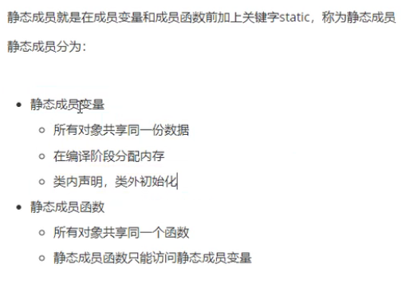

### 静态成员变量
```cpp
#include <iostream>
using namespace std;

//静态成员变量
class Person
{
public:
    //1.所有对象都共享同一份数据
    //2.编译阶段就分配内存
    //3. 类内声明，类外初始化
    static int m_a;//类内声明
private:
    static int m_b;
};
int Person::m_a=100;//类外初始化
int Person::m_b=300;//类外初始化
void test01()
{
    Person p;
    cout<<p.m_a<<endl;//100

    Person p2;
    p2.m_a=200;
    cout<<p.m_a<<endl;//200 所有对象都共享同一份数据
}

void test02()
{
    //所有对象都共享同一份数据
    //静态成员变量有两种访问方式
    //1.通过对象进行访问
    Person p;
    cout<<p.m_a<<endl;//200
    //2.通过类名进行访问
    cout<<Person::m_a<<endl;//200

    //静态成员变量也是有访问权限的
    //cout<<Person::m_b<<endl;//m_b是私有的，因此类外不能访问
}
int main()
{
    test01();
    test02();
}
```

### 静态成员函数

```cpp
#include <iostream>
using namespace std;

class Person
{
public:
    //静态成员函数
    static void func()
    {
        m_a=100;//静态成员函数可以访问静态成员变量
        //m_b=10000;//静态成员函数不可以访问非静态成员变量，因为无法区分到底是哪个对象的
        cout<<"static void func的调用"<<endl;
    }
    static int m_a;//静态成员变量
    int m_b;//非静态成员变量
private:
    static void func2()
    {
        cout<<"static void func2的调用"<<endl;
    }
};
int Person::m_a=0;//静态成员变量

void test01()
{
    //1.通过对象进行访问
    Person p;
    p.func();

    //2.通过类名进行访问
    Person::func();

    //Person::func2();//错误，func2是私有的，类外访问不到私有静态成员函数
}
int main()
{
    test01();
}
```

## 成员变量和成员函数分开存储
在C++中，成员变量和成员函数是分开存储的，只有非静态成员变量才属于类的对象

```cpp
#include <iostream>
using namespace std;

class Person
{
public:
    int m_a;//非静态成员变量，属于类的对象上的数据，占4个字节
    static int m_b;//静态成员变量，不属于类的对象上的数据
    void func(){}//非静态成员函数，不属于类的对象上的数据
    static void func2(){}//静态成员函数，不属于类的对象上的数据
};
void test01()
{
    Person p;
    //空对象占用的内存空间
    //C++编译器会给每个空对象也分配一个字节空间，是为了区分空对象占内存的位置
    //每个空对象也应该有一个独一无二的内存地址
    cout<<"sizeof(p)="<<sizeof(p)<<endl;//sizeof(p)=1
}
void test02()
{
    Person p;
    cout<<"sizeof(p)="<<sizeof(p)<<endl;//sizeof(p)=4
}
int main()
{
    test01();
}
```
## this指针
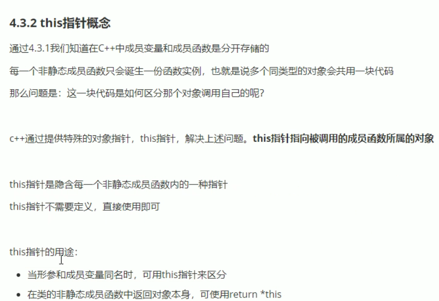

```cpp
#include <iostream>
using namespace std;

class Person
{
public:
    Person(int age)
    {
        this->age=age;//this指针指向被调用的成员函数
    }
    //若以值方式返回，会创建新的对象，所以这里用引用&
    Person& PersonAddAge(Person &p)
    {
        this->age+=p.age;
        return *this;//返回对象本身
    }
    int age;//形参和变量名字相同，会出错，需要加个this，或者给变量改个名，比如m_age.
};
void test01()
{
    Person p1(18);
    cout<<"p1 的年龄"<<p1.age<<endl;//p1 的年龄18
}
//2.返回对象本身
void test02()
{
    Person p1(10);
    Person p2(10);
    //链式编程思想
    p2.PersonAddAge(p1).PersonAddAge(p1);
    cout<<"p2 age:"<<p2.age<<endl;//p2 age:30
}
int main()
{
    test01();
    test02();
}
```

## 空指针访问成员函数
```cpp
#include <iostream>
using namespace std;

class Person
{
public:
    void showClassName()
    {
        cout<<"this is a person class"<<endl;
    }
    void showPersonAge()
    {
        //处理空指针的情况
        if (this ==NULL) return;
        cout<<"age="<<m_age<<endl;//相当于cout<<"age="<<this->m_age<<endl;
    }
    int m_age;
};

void test01()
{
    //空指针访问成员函数
    Person *p=NULL;
    p->showClassName();
    p->showPersonAge();
    
    //非空指针访问成员函数
    Person p1;
    Person *p2=&p1;
    p2->m_age=10;
    cout<<p2<<endl;
    p2->showClassName();
    p2->showPersonAge();
}

int main()
{
    test01();
}
```
输出：
```
this is a person class
0x61fddc
this is a person class
age=10
```

## const修饰成员函数
常函数：
- 成员函数后加const后，我们称这个函数为常函数
- 常函数内不可以修改成员属性
- 成员属性声明时加关键字mutable后，在常函数中依然可以修改

```cpp
#include <iostream>
using namespace std;

//常函数
class Person
{
public:
    //this指针的本质：指针常量，因此指针的指向是不可修改的
    // Person*cosnt this; 等价于void showPerson()
    void showPerson() const //const修饰this指针,等价于const Person*cosnt this; 此时指向和指向的值都不能修改
    {
        //无法执行，因为用了const修饰指针this，此时this的指向和指向对应的的值都不能被修改
        //m_a=100;//它等价于this->m_a=100; 
        this->m_b=100;//可以修改，因为用了mutable及进行修饰
    }
    int m_a;
    mutable int m_b;//成员属性声明时加关键字mutable后，在常函数中依然可以修改
};
void test01()
{
    Person p;
    p.showPerson();
}

int main()
{
    test01();
}
```

常对象：
- 声明对象前加const称改对象为常对象
- 常对象只能调用常函数

```cpp
#include <iostream>
using namespace std;

//常函数
class Person
{
public:
    //this指针的本质：指针常量，因此指针的指向是不可修改的
    // Person*cosnt this; 等价于void showPerson()
    void showPerson() const //const修饰this指针,等价于const Person*cosnt this; 此时指向和指向的值都不能修改
    {
        //无法执行，因为用了const修饰指针this，此时this的指向和指向对应的的值都不能被修改
        //m_a=100;//它等价于this->m_a=100; 
        this->m_b=100;//可以修改，因为用了mutable及进行修饰
    }
    void func()
    {
        m_a=100;
    }
    int m_a;
    mutable int m_b;//成员属性声明时加关键字mutable后，在常函数中依然可以修改
};
void test01()
{
    Person p;
    p.showPerson();
}
void test02()
{
    const Person p{};//在对象前加const，变为常对象 不加{}报错，不知道为什么
    //p.m_a=100;//assignment of member 'Person::m_a' in read-only object
    p.m_b=100;
    p.showPerson();//常对象只能调用常函数
    //p.func();//常对象只不能调用普通成员函数,passing 'const Person' as 'this' argument discards qualifiers [-fpermissive]
}
int main()
{
    test01();
    test02();
}
```

## 友元
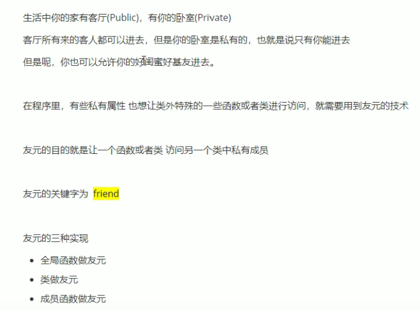

### 全局函数做友元
```cpp
#include <iostream>
using namespace std;

class Building
{
public:
    Building()
    {
        m_sittingroom="客厅";
        m_bedroom="卧室";
    }
public:
    string m_sittingroom;//客厅
private:
    string m_bedroom;//卧室
};

void goodDay(Building *building) 
{
    cout<<"好基友全局函数正在访问"<<building->m_sittingroom<<endl;
    //cout<<"好基友全局函数正在访问"<<building->m_bedroom<<endl;//私有成员不能访问，note: declared private here
}
void test01()
{
    Building building;
    goodDay(&building);
}
int main()
{
    test01();
}
```

使用友元就可以访问私有成员了：
```cpp
#include <iostream>
using namespace std;

class Building
{
    //goodDay全局函数是Building的好朋友，因此可以访问Building中的私有成员
    friend void goodDay(Building *building);

public:
    Building()
    {
        m_sittingroom="客厅";
        m_bedroom="卧室";
    }
public:
    string m_sittingroom;//客厅
private:
    string m_bedroom;//卧室
};

//D->G。。。
void goodDay(Building *building) 
{
    cout<<"好基友全局函数正在访问"<<building->m_sittingroom<<endl;
    cout<<"好基友全局函数正在访问"<<building->m_bedroom<<endl;//可以访问了！
}
void test01()
{
    Building building;
    goodDay(&building);
}
int main()
{
    test01();
}
```

### 类做友元
```cpp
#include <iostream>
using namespace std;

//类做友元

//建筑物的类
class Building
{
    //GoodGay是Building的好朋友，可以访问私有的
    friend class GoodGay;
public:
    string m_sittingroom;//客厅
private:
    string m_bedroom;//卧室
public:
    Building()
    {
        m_sittingroom="客厅";
        m_bedroom="卧室";
    }

};
//好基友的类
class GoodGay
{
public:
    GoodGay()
    {
        //创建一个建筑物的对象
        building=new Building;//返回指针
    }
    //参观函数，访问Building中的属性(公共和私有属性都访问)
    void visit()
    {
        cout<<"好基友类正在访问"<<building->m_sittingroom<<endl;
        cout<<"好基友类正在访问"<<building->m_bedroom<<endl;
    }
    Building *building;
};


void test01()
{
    GoodGay gg;
    gg.visit();
}


int main()
{
    test01();
}
```
###  成员函数做友元
```cpp
#include <iostream>
#include <string>
using namespace std;

class Building;

//好基友类
class GoodGay
{
public:
    GoodGay();
    void visit();//让visit函数可以访问Building中的私有成员
    void visit2();//让visit2函数不可以分为Building中的私有成员
    Building *building;
};


//建筑类
class Building
{
//成员函数作为友元
friend void GoodGay::visit();
friend void GoodGay::visit2();
public:
    Building();

public:
    string m_sittingroom;//客厅
private:
    string m_bedroom;//卧室
};

//类外实现成员函数
Building::Building()
{
    m_sittingroom="客厅";
    m_bedroom="卧室";
}
GoodGay::GoodGay()
{
    building=new Building;
}

//让visit函数可以访问Building中的私有成员
void GoodGay::visit()
{
    cout<<"visit函数正在访问"<<building->m_sittingroom<<endl;
    cout<<"visit函数正在访问"<<building->m_bedroom<<endl;
}
//让visit2函数不可以分为Building中的私有成员
void GoodGay::visit2()
{
    cout<<"visit2函数正在访问"<<building->m_sittingroom<<endl;
    cout<<"visit2函数正在访问"<<building->m_bedroom<<endl;
}

void test01()
{
    GoodGay gg;
    gg.visit();
    gg.visit2();
}

int main()
{
    test01();
}
```

## C++ 运算符重载
对已有的运算符重新进行定义，赋予其另一种功能，以适应不同的数据类型
### 加法运算符重载
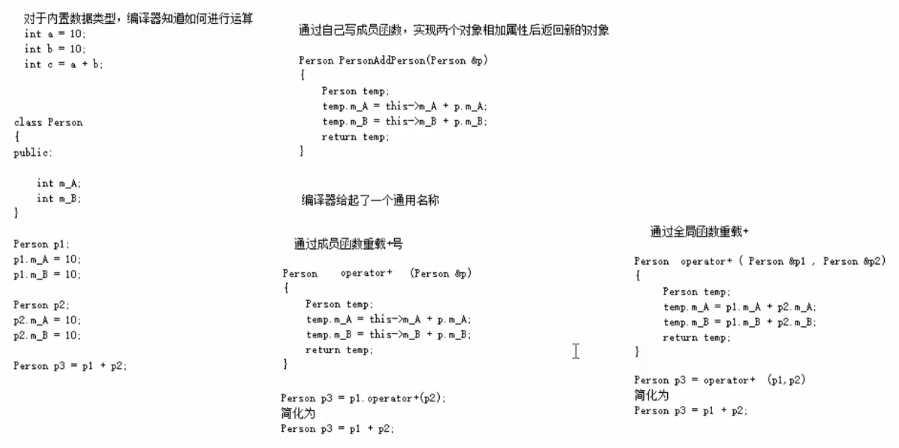

方法1：成员函数重载+
```cpp
#include <iostream>
using namespace std;

class Person
{
public:
    //1.成员函数重载+
    Person operator+(Person &p)
    {
        Person temp;
        temp.m_a=this->m_a+p.m_a;
        temp.m_b=this->m_b+p.m_b;
        return temp;
    }


    int m_a,m_b;
};

void test01()
{
    Person p1,p2;
    p1.m_a=10;p1.m_b=10;
    p2.m_a=10;p2.m_b=10;

    Person p3=p1+p2;
    cout<<p3.m_a<<" "<<p3.m_b<<endl;//20 20
}

int main()
{
    test01();
}
```

方法2：全局函数重载+
```cpp
#include <iostream>
using namespace std;

class Person
{
public:
    // //1.成员函数重载+
    // Person operator+(Person &p)
    // {
    //     Person temp;
    //     temp.m_a=this->m_a+p.m_a;
    //     temp.m_b=this->m_b+p.m_b;
    //     return temp;
    // }


    int m_a,m_b;
};

//2. 全局函数重载+
Person operator+(Person &p1,Person &p2)
{
    Person temp;
    temp.m_a=p1.m_a+p2.m_a;
    temp.m_b=p1.m_b+p2.m_b;
    return temp;
}

void test01()
{
    Person p1,p2;
    p1.m_a=10;p1.m_b=10;
    p2.m_a=10;p2.m_b=10;

    Person p3=p1+p2;
    cout<<p3.m_a<<" "<<p3.m_b<<endl;//20 20
}

int main()
{
    test01();
}
```

运算符重载，也可以发生函数重载

比如Person类和int做加法：
```cpp
#include <iostream>
using namespace std;

class Person
{
public:
    // //1.成员函数重载+
    // Person operator+(Person &p)
    // {
    //     Person temp;
    //     temp.m_a=this->m_a+p.m_a;
    //     temp.m_b=this->m_b+p.m_b;
    //     return temp;
    // }


    int m_a,m_b;
};

//2. 全局函数重载+
// Person operator+(Person &p1,Person &p2)
// {
//     Person temp;
//     temp.m_a=p1.m_a+p2.m_a;
//     temp.m_b=p1.m_b+p2.m_b;
//     return temp;
// }
//函数重载的版本
Person operator+(Person &p1,int num)
{
    Person temp;
    temp.m_a=p1.m_a+num;
    temp.m_b=p1.m_b+num;
    return temp;
}
void test01()
{
    Person p1,p2;
    p1.m_a=10;p1.m_b=10;
    p2.m_a=10;p2.m_b=10;

    Person p3=p1+100;//Person + int
    cout<<p3.m_a<<" "<<p3.m_b<<endl;//110 110
}

int main()
{
    test01();
}
```
### 左移运算符重载

作用：输出自定义的数据类型

```cpp
#include <iostream>
using namespace std;

class Person
{
public:
    //不会利用成员运算符重载左移运算符
    // //利用成员函数重载 左移运算符
    // void operator<<(Person&p)
    // {
    // }
    int m_a,m_b;
};

ostream &operator<<(ostream &cout,Person &p)//本质：operator<<(cout,p),简化为:cout<<p
{
    cout<<p.m_a<<" "<<p.m_b<<endl;
    return cout;//链式编程思想
}
void test01()
{
    Person p;
    p.m_a =10;
    p.m_b =10;

    cout<<p.m_a<<" "<<p.m_b<<endl;//10 10
    
    //使用<<重载来直接输出p
    cout<<p;//10 10
    //cout<<p<<endl;中，根据链式编程思想可以追加多个<<
}

int main()
{
    test01();
}
```

### 递增运算符重载

前置递增返回引用，后置递增返回值
```cpp
#include <iostream>
using namespace std;


class MyInteger
{
    friend ostream& operator<<(ostream& cout, MyInteger myint);
public:
    MyInteger()
    {
        m_num=0;
    }
    //重载前置++运算符
    MyInteger& operator++()
    {
        m_num+=1;//先做自增运算
        return *this;//再将自身返回
    }

    //重载后置++运算符，此时不用返回引用，因为temp是临时的
    MyInteger operator++(int)//int:占位参数，可以用于区分前置递增和后置递增
    {
        MyInteger temp=*this;//先记录当时的结果
        m_num+=1;//后做自增运算
        return temp;
    }
private:
    int m_num;
};
//全局函数重载左移运算符，返回引用是为了对一个同变量进行自增操作
ostream& operator<<(ostream& cout, MyInteger myint)
{
    cout<<myint.m_num<<endl;
    return cout;
}
void test01()
{
    MyInteger myint;
    cout<<myint<<endl;//0
    
    //使用重载的前置++
    cout<<++myint<<endl;//1

    cout<<++(++myint)<<endl;//3
}

void test02()
{
    MyInteger myint;
    //使用重载的后置++
    cout<<myint++<<endl;//0
    cout<<myint<<endl;//1
    cout<<(myint++)++<<endl;//1
    cout<<myint<<endl;//2
}
int main()
{
    test01();
    test02();
}
```

### 赋值运算符重载
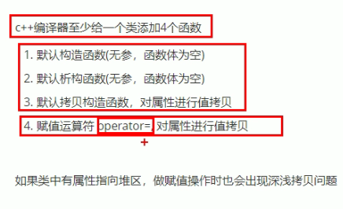

默认的赋值运算符=是浅拷贝：
```cpp
#include <iostream>
using namespace std;

class Person
{
public:
    Person(int age)
    {
        m_age=new int(age);//将数据开辟到堆区
    }
    ~Person()
    {
        if (m_age!=NULL)
        {
            delete m_age;
            m_age=NULL;
        }
    }

    int *m_age;
};

void test01()
{
    Person p1(18);
    cout<<"p1的年龄："<<*p1.m_age<<endl;//p1的年龄：18

    Person p2(20);
    cout<<"p2的年龄："<<*p2.m_age<<endl;//p1的年龄：20

    p2=p1;//赋值操作，浅拷贝
    cout<<"p2的年龄："<<*p2.m_age<<endl;//p1的年龄：18

    //深拷贝

}

int main()
{
    test01();
}
```

可通过重载=实现深拷贝：
```cpp
#include <iostream>
using namespace std;

class Person
{
public:
    Person(int age)
    {
        m_age=new int(age);//将数据开辟到堆区
    }
    ~Person()
    {
        if (m_age!=NULL)
        {
            delete m_age;
            m_age=NULL;
        }
    }
    //操作赋值运算符，使其成为深拷贝
    Person& operator=(Person&p)
    {
        //编译器提供的=是浅拷贝
        //m_age=p.m_age;

        //应该先判断是否有属性在堆区，如果有，应该先释放干净，然后再做深拷贝
        if(m_age!=NULL)
        {
            delete m_age;
            m_age=NULL;
        }

        m_age = new int(*p.m_age);//指针哦~

        return *this;
    }
    int *m_age;
};

void test01()
{
    Person p1(18);
    cout<<"p1的年龄："<<*p1.m_age<<endl;//p1的年龄：18

    Person p2(20);
    cout<<"p2的年龄："<<*p2.m_age<<endl;//p1的年龄：20

    p2=p1;//赋值操作，深拷贝
    cout<<"p2的年龄："<<*p2.m_age<<endl;//p1的年龄：18

    Person p3(21);

    p3=p2=p1;
    cout<<"p3的年龄："<<*p3.m_age<<"p2的年龄："<<*p2.m_age<<"p1的年龄："<<*p1.m_age<<endl;
    //p3的年龄：18p2的年龄：18p1的年龄：18
}

int main()
{
    test01();
}
```

### 关系运算符重载
```cpp
#include <iostream>
#include <string>
using namespace std;

class Person
{
public:
    Person(string name,int age)
    {
        m_name = name;
        m_age = age;
    }

    //重载==
    bool operator==(Person &p)
    {
        if (this->m_name == p.m_name && this->m_age == p.m_age)
        {
            return true;
        }
        return false;
    }
    //重载!=
    bool operator!=(Person &p)
    {
        if (this->m_name != p.m_name || this->m_age != p.m_age)
        {
            return true;
        }
        return false;
    }

    string m_name;
    int m_age;
};

void test01()
{
    Person p1("Tom",18);
    Person p2("Tom",18);

    if (p1==p2)
    {
        cout<<"p1=p2"<<endl;
    }
    else
    {
        cout<<"p1!=p1"<<endl;
    }
    //p1=p2

    Person p3("Tom",18);
    Person p4("Tom",180);
    if(p3!=p4)
    {
        cout<<"p3!=p4"<<endl;
    }
    //p3!=p4
}

int main()
{
    test01();
}
```

### 函数调用运算符()重载

由于重载后使用的方式非常像函数的调用，因此称为仿函数

仿函数没有固定写法，非常灵活

打印输出：
```cpp
#include <iostream>
#include <string>
using namespace std;

//打印输出类
class MyPrint
{
public:
    //重载函数调用运算符()
    void operator()(string test)
    {
        cout<<test<<endl;
    }
};
//普通函数
void MyPrint02(string test)
{
    cout<<test<<endl;
}

void test01()
{
    //函数调用运算符()重载
    MyPrint myprint;
    myprint("Hello World!");

    //普通函数调用
    MyPrint02("Hello World!");
}

int main()
{
    test01();
}
```

加法：
```cpp
#include <iostream>
#include <string>
using namespace std;

//加法类
class MyAdd
{
public:
    int operator()(int num1,int num2)
    {
        return num1+num2;
    }
};

void test02()
{
    //函数调用运算符()重载
    MyAdd myadd;
    int  ret=myadd(100,100);
    cout<<"ret:"<<ret<<endl;
}

int main()
{
    test02();//ret:200
}
```

改成匿名对象：
```cpp
#include <iostream>
#include <string>
using namespace std;

//加法类
class MyAdd
{
public:
    int operator()(int num1,int num2)
    {
        return num1+num2;
    }
};

void test02()
{
    //函数调用运算符()重载
    // MyAdd myadd;
    // int  ret=myadd(100,100);
    // cout<<"ret:"<<ret<<endl;

    //匿名对象
    cout<<MyAdd()(100,100)<<endl;
}

int main()
{
    test02();//200
}
```

## 继承

### 基本语法

语法：class 子类:继承方式 父类

不使用继承，会造成大量的代码重复：
```cpp
#include <iostream>
using namespace std;

//普通页面实现

//Java页面
class Java
{
public:
    void header()
    {
        cout<<"首页、公开课、登录、注册...(公共头部)"<<endl;
    }
    void footer()
    {
        cout<<"帮助中心、交流合作、站内地图...(公共底部)"<<endl;
    }
    void left()
    {
        cout<<"Java,Python,C++...(公共分类列表)"<<endl;
    }
    void content()
    {
        cout<<"Java学科视频"<<endl;
    }
};
//Python页面
class Python
{
public:
    void header()
    {
        cout<<"首页、公开课、登录、注册...(公共头部)"<<endl;
    }
    void footer()
    {
        cout<<"帮助中心、交流合作、站内地图...(公共底部)"<<endl;
    }
    void left()
    {
        cout<<"Java,Python,C++...(公共分类列表)"<<endl;
    }
    void content()
    {
        cout<<"Python学科视频"<<endl;
    }
};

//C++页面
class Cpp
{
public:
    void header()
    {
        cout<<"首页、公开课、登录、注册...(公共头部)"<<endl;
    }
    void footer()
    {
        cout<<"帮助中心、交流合作、站内地图...(公共底部)"<<endl;
    }
    void left()
    {
        cout<<"Java,Python,C++...(公共分类列表)"<<endl;
    }
    void content()
    {
        cout<<"C++学科视频"<<endl;
    }
};
void test01()
{
    cout<<"Java下载视频页面如下："<<endl;
    Java ja;
    ja.header();
    ja.footer();
    ja.left();
    ja.content();

    cout<<"Python下载视频页面如下："<<endl;
    Python py;
    py.header();
    py.footer();
    py.left();
    py.content();

    cout<<"C++下载视频页面如下："<<endl;
    Cpp cpp;
    cpp.header();
    cpp.footer();
    cpp.left();
    cpp.content();

}
int main()
{
    test01();
}
```

使用继承，可以减少很多重复代码：
```cpp
#include <iostream>
using namespace std;


//公共信息
class BasePage
{
public:
    void header()
    {
        cout<<"首页、公开课、登录、注册...(公共头部)"<<endl;
    }
    void footer()
    {
        cout<<"帮助中心、交流合作、站内地图...(公共底部)"<<endl;
    }
    void left()
    {
        cout<<"Java,Python,C++...(公共分类列表)"<<endl;
    }
};

//Java页面
class Java:public BasePage
{
public:
    void content()
    {
        cout<<"Java学科视频"<<endl;
    }
};

//Python页面
class Python:public BasePage
{
public:
    void content()
    {
        cout<<"Python学科视频"<<endl;
    }
};
//C++页面
class Cpp:public BasePage
{
public:
    void content()
    {
        cout<<"C++学科视频"<<endl;
    }
};


void test01()
{
    cout<<"Java下载视频页面如下："<<endl;
    Java ja;
    ja.header();
    ja.footer();
    ja.left();
    ja.content();

    cout<<"Python下载视频页面如下："<<endl;
    Python py;
    py.header();
    py.footer();
    py.left();
    py.content();

    cout<<"C++下载视频页面如下："<<endl;
    Cpp cpp;
    cpp.header();
    cpp.footer();
    cpp.left();
    cpp.content();

}
int main()
{
    test01();
}
```

## 继承方式

继承方式共3种：
- 公共继承
- 保护继承
- 私有继承

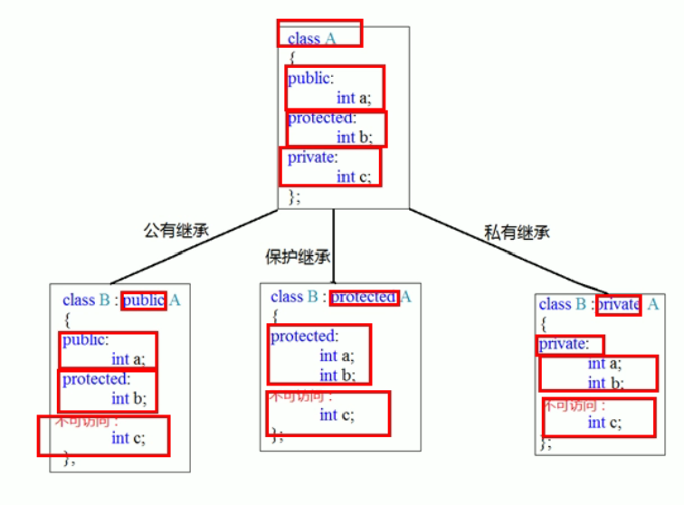

```cpp
#include <iostream>
using namespace std;

//公共继承

//父类
class Base1
{
public:
    int m_a;
protected:
    int m_b;
private:
    int m_c;
};

class Son1:public Base1
{
public:
    void func()
    {
        m_a=10;//父类中的公共权限成员，到子类中依然是公共权限
        m_b=10;//父类中的保护权限成员，到子类中依然是保护权限
        //m_c=10;//父类中的私有权限成员，子类访问不到
    }
};

void test01()
{
    Son1 s1;
    s1.m_a=100;//公共权限，类内类外都能访问
    //s1.m_b=100;//保护权限，类外不能访问
}
///////////////////////////////////////////////////////////////

//保护继承

//父类
class Base2
{
public:
    int m_a;
protected:
    int m_b;
private:
    int m_c;
};

class Son2:protected Base2
{
public:
    void func()
    {
        m_a=10;//父类中的公共权限成员，到子类中变为保护权限
        m_b=10;//父类中的保护权限成员，到子类中依然是保护权限
        //m_c=10;//父类中的私有权限成员，子类访问不到
    }
};
void test02()
{
    Son2 s1;
    //s1.m_a=1000;//保护权限，类外访问不到
    //s1.m_b=1000;//保护权限，类外访问不到
    //s1.m_c=10;//私有权限成员，类外访问不到
}

/////////////////////////////////////////////////////////////
//保护继承

//父类
class Base3
{
public:
    int m_a;
protected:
    int m_b;
private:
    int m_c;
};

class Son3:private Base3
{
public:
    void func()
    {
        m_a=10;//父类中的公共权限成员，到子类中变为s私有权限
        m_b=10;//父类中的保护权限成员，到子类中变为私有权限
        //m_c=10;//父类中的私有权限成员，子类访问不到
    }
};
void test03()
{
    Son3 s1;
    //s1.m_a=1000;//私有权限，类外访问不到
    //s1.m_b=1000;//私有权限，类外访问不到
    //s1.m_c=1000;////私有权限成员，类外访问不到
}

/////////////////////////////////////////////////////////////
class GrandSon3:public Son3//Son3的儿子，Base3的孙子
{
    void func()
    {
        //m_a=10;//父类中的私有权限成员，子类访问不到 
        //m_b=10;//父类中的私有权限成员，子类访问不到 
        //m_c=10;//父类中的私有权限成员，子类访问不到 
    }
};


int main()
{
    test01();
    test02();
    test03();
}
```

### 继承中的对象模型

父类中所有非静态的成员属性都会被子类继承下去

父类中的私有成员属性 是被编译器隐藏了，因此是访问不到的，但是确实被子类继承了

```cpp
#include <iostream>
using namespace std;

class Base
{
public:
    int m_a;
protected:
    int m_b;
private:
    int m_c;
};

class Son:public Base
{
public:
    int m_d;
};

void test01()
{
    cout<<"sizeof Son="<<sizeof(Son)<<endl;//sizeof Son=16

int main()
{
    test01();
}
```

### 继承中的构造和析构的顺序

子类继承父类后，当创建子类对象时，也会调用父类的构造函数

问题：父类和子类的构造和析构顺序是谁先谁后？

```cpp
#include <iostream>
using namespace std;

class Base
{
public:
    Base()
    {
        cout<<"Base的构造函数"<<endl;
    }
    ~Base()
    {
        cout<<"Base的析构函数"<<endl;
    }
};

class Son:public Base
{
public:
    Son()
    {
        cout<<"Son的构造函数"<<endl;
    }
    ~Son()
    {
        cout<<"Son的析构函数"<<endl;
    }
}; 

void test01()
{
    //Base b;

    Son s;
    
}

int main()
{
    test01();
}
```

输出:
```
Base的构造函数
Son的构造函数
Son的析构函数
Base的析构函数
```

结论：继承中，先构造父类，再构造子类，析构顺序与构造顺序相反。

### 同名成员处理
问题：当子类和父类出现同名的成员时，如何通过子类对象，访问到子类或父类中同名的数据呢？

- 访问子类同名成员：直接访问即可
- 访问父类同名成员：需要加作用域

```cpp
#include <iostream>
using namespace std;

class Base
{
public:
    int m_a;
    Base()
    {
        m_a=100;
    }

    void func()
    {
        cout<<"Base func 的调用"<<endl;
    }
};

class Son:public Base
{
public:
    Son()
    {
        m_a=200;
    }
    int m_a;

    void func()
    {
        cout<<"Son func 的调用"<<endl;
    }
};

//同名成员属性的处理方式
void test01()
{
    Son s;
    cout<<"Son m_a="<<s.m_a<<endl;//Son m_a=20

    //如果通过子类对象范围到父类中的同名成员，需要加一个父类的作用域
    cout<<"Base m_a="<<s.Base::m_a<<endl;//Base m_a=100
}

//同名成员属性的处理方式
void test02()
{
    Son s;
    //直接调用，调用的是子类中的同名成员函数
    s.func();//Son func 的调用 

    //调用父类中的同名成员函数
    s.Base::func();//Base func 的调用
}

int main()
{
    test01();
    test02();
}
```

还有，如果父类中实现了同名函数的重载，那么子类中的同名函数仍然会隐藏掉父类中的同名成员函数

弱如果想要访问父类中被隐藏的同名成员函数，需要加父类的作用域

```cpp
#include <iostream>
using namespace std;

class Base
{
public:
    int m_a;
    Base()
    {
        m_a=100;
    }

    void func()
    {
        cout<<"Base func 的调用"<<endl;
    }
    //构造函数重载
    void func(int a)
    {
        cout<<"Base func 的调用"<<endl;
    }
};

class Son:public Base
{
public:
    Son()
    {
        m_a=200;
    }
    int m_a;

    void func()
    {
        cout<<"Son func 的调用"<<endl;
    }
};


//同名成员属性的处理方式
void test02()
{
    Son s;
    //直接调用，调用的是子类中的同名成员函数
    s.func();//Son func 的调用 

    //调用父类中的同名成员函数
    s.Base::func(1);//Base func 的调用
}

int main()
{
    test02();
}
```

### 继承同名静态成员的处理方式

问题：继承中同名的静态成员在子类对象上如何进行访问？

答案静态成员和非静态成员出现同名，处理方式一致

即：

- 访问子类同名成员：直接访问即可
- 访问父类同名成员：需要加作用域

同名静态成员属性：
```cpp
#include <iostream>
using namespace std;

class Base
{
public:
    static int m_a;//类内声明
};

int Base::m_a=100;//类外初始化

class Son:public Base
{
public:
    static int m_a;//类内声明
};
int Son::m_a=200;//类外初始化

//同名静态成员属性
void test01()
{
    //1.通过对象来访问数据
    Son s;
    cout<<"Son m_a="<<s.m_a<<endl;//Son m_a=200
    cout<<"Base m_a="<<s.Base::m_a<<endl;//Base m_a=100

    //2.通过类名访问数据
    cout<<"Son m_a="<<Son::m_a<<endl;//Son m_a=200
    //直接访问Base的m_a
    cout<<"Base m_a="<<Base::m_a<<endl;//Base m_a=100
    //子类访问其父类Base作用域下的m_a
    cout<<"Base m_a="<<Son::Base::m_a<<endl;//Base m_a=100
}


int main()
{
    test01();
}
```
同名静态成员函数：`
```cpp
#include <iostream>
using namespace std;

class Base
{
public:
    static int m_a;//类内声明
    static void func()
    {
        cout<<"Base static void func 的调用"<<endl;
    }
};

int Base::m_a=100;//类外初始化

class Son:public Base
{
public:
    static int m_a;//类内声明
    static void func()
    {
        cout<<"Son static void func 的调用"<<endl;
    }
};
int Son::m_a=200;//类外初始化

//同名静态成员函数
void test02()
{
    //1. 通过对象访问
    Son s;
    s.func();//Son static void func 的调用
    s.Base::func();//Base static void func 的调用

    //2.通过类名访问
    Son::func();//Son static void func 的调用
    Son::Base::func();//Base static void func 的调用
}

int main()
{
    test02();
}
```

同样，若父类中有同名成员函数的重载，当子类中有同名成员函数时，会把父类中对应的同名成员函数给隐藏掉。

可以加上父类作用域来实现父类同名函数的调用，比如`Son::Base::func(100)`:
```cpp
#include <iostream>
using namespace std;

class Base
{
public:
    static int m_a;//类内声明
    static void func()
    {
        cout<<"Base static void func 的调用"<<endl;
    }
    static void func(int a)
    {
        cout<<"Base static void func 的调用"<<endl;
    }
};

int Base::m_a=100;//类外初始化

class Son:public Base
{
public:
    static int m_a;//类内声明
    static void func()
    {
        cout<<"Son static void func 的调用"<<endl;
    }

};
int Son::m_a=200;//类外初始化

//同名静态成员函数
void test02()
{
    //1. 通过对象访问
    Son s;
    s.func();//Son static void func 的调用
    s.Base::func();//Base static void func 的调用

    //2.通过类名访问
    Son::func();//Son static void func 的调用
    Son::Base::func();//Base static void func 的调用

    //子类出现和父类同名的静态成员函数时，也会隐藏掉父类中所有的同名成员函数
    //如果想访问父类中被因此的题目成员，需要加父类的作用域
    Son::Base::func(0);//Base static void func 的调用
}

int main()
{
    test02();
}
```
### 继承多个类

C++允许一个类继承多个类

语法： class 子类:继承方式 父类1,继承方式 父类2, ...

多继承可能会引发父类中有题目函数出现，需要加作用域区分

C++实际开发中不建议用多继承

```cpp
#include <iostream>
using namespace std;

class Base1
{
public:
    Base1()
    {
        m_a=100;
    }
    int m_a;
};
class Base2
{
public:
    Base2()
    {
        m_b=200;
    }
    int m_b;
};

//子类Son同时继承Base1和Base2
class Son:public Base1,public Base2
{
public:
    Son()
    {
        m_c=300;
        m_d=400;
    }
    int m_c;
    int m_d;
};

void test01()
{
    Son s;
    cout<<"sizeof Son="<<sizeof(Son)<<endl;//sizeof Son=16
}
int main()
{
    test01();
}
```
当父类中出现同名成员，需要加作用域:
```cpp
#include <iostream>
using namespace std;

class Base1
{
public:
    Base1()
    {
        m_a=100;
    }
    int m_a;
};
class Base2
{
public:
    Base2()
    {
        m_a=111;
        m_b=200;
    }
    int m_a,m_b;
};

//子类Son同时继承Base1和Base2
class Son:public Base1,public Base2
{
public:
    Son()
    {
        m_c=300;
        m_d=400;
    }
    int m_c;
    int m_d;
};

void test01()
{
    Son s;
    cout<<"sizeof Son="<<sizeof(Son)<<endl;//sizeof Son=16

    //当父类中出现同名成员，需要加作用域
    cout<<"Base1::m_a="<<s.Base1::m_a<<endl;//Base1::m_a=100
    cout<<"Base2::m_a="<<s.Base2::m_a<<endl;//Base2::m_a=111    
}
int main()
{
    test01();
}
```

### 菱形继承

两个子类继承同一个父类，又有某个类同时继承这两个子类，这种继承被称为菱形继承，也叫钻石继承。

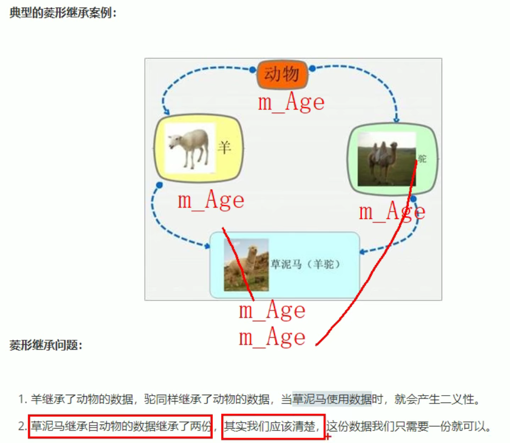

只要一个年龄就行，这里有两份，导致资源浪费：
```cpp
#include <iostream>
using namespace std;

//动物类
class Animal
{
public:
    int m_age;
};

//羊类
class Sheep:public Animal{};

//驼类
class Tuo:public Animal{};

//羊驼类
class SheepTuo:public Sheep, public Tuo{};

void test01()
{
    SheepTuo st;
    st.Sheep::m_age=18;
    st.Tuo::m_age=20;
    //当零星继承，两个父类拥有相同数据，需要加作用域用以区分
    cout<<"st.Sheep::m_age="<<st.Sheep::m_age<<endl;//st.Sheep::m_age=18
    cout<<"st.Tuo::m_age="<<st.Tuo::m_age<<endl;//st.Tuo::m_age=20
    //只要一个年龄就行，这里有两份，导致资源浪费
    
}

int main()
{
    test01();
}
```
利用虚继承 可以解决菱形继承的问题

继承之前，加上关键字virtual变为虚继承，这个类就叫做 虚基类

vbptr:虚基类指针 vitrual base pointer

```cpp
#include <iostream>
using namespace std;

//动物类
class Animal
{
public:
    int m_age;
};

//羊类
class Sheep:virtual public Animal{};

//驼类
class Tuo: virtual public Animal{};

//羊驼类
class SheepTuo:public Sheep, public Tuo{};

void test01()
{
    SheepTuo st;
    st.Sheep::m_age=18;
    st.Tuo::m_age=20;
    //当菱形继承，两个父类拥有相同数据，需要加作用域用以区分
    cout<<"st.Sheep::m_age="<<st.Sheep::m_age<<endl;//st.Sheep::m_age=20
    cout<<"st.Tuo::m_age="<<st.Tuo::m_age<<endl;//st.Tuo::m_age=20

    //当使用虚继承后，可以不加作用域了，因为此时就一份数据
    cout<<"st.m_age="<<st.m_age<<endl;//st.m_age=20

}

int main()
{
    test01();
}
```
## 多态
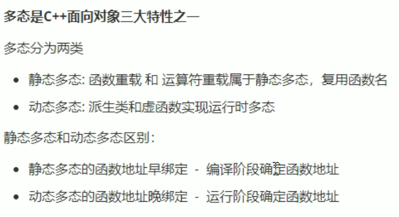

地址早绑定，在编译阶段就确定了函数的地址:
```cpp
#include <iostream>
using namespace std;

//动物类
class Animal
{
public:
    void speak()
    {
        cout<<"动物在说话"<<endl;
    }
};

//猫类
class Cat:public Animal
{
public:
    void speak()
    {
        cout<<"小猫在说话"<<endl;
    }
};

//说话

//地址早绑定，在编译阶段就确定了函数的地址
//如果想让猫说话，那么这个函数地址不能提前绑定，需要在运行阶段进行别的，即地址晚绑定
void DoSpeak(Animal& animal)//Animal& annmal ==> cat
{
    animal.speak();
}

void test01()
{
    Cat cat;
    DoSpeak(cat);
}

int main()
{
    test01();
}
```
输出:动物在说话

如果想让猫说话，那么这个函数地址不能提前绑定，需要在运行阶段进行别的，即地址晚绑定:
```cpp
#include <iostream>
using namespace std;

//动物类
class Animal
{
public:
    //虚函数
    virtual void speak()
    {
        cout<<"动物在说话"<<endl;
    }
};

//猫类
class Cat:public Animal
{
public:
   
    void speak()
    {
        cout<<"小猫在说话"<<endl;
    }
};

//说话

//地址早绑定，在编译阶段就确定了函数的地址
//如果想让猫说话，那么这个函数地址不能提前绑定，需要在运行阶段进行别的，即地址晚绑定
void DoSpeak(Animal& animal)//Animal& annmal ==> cat
{
    animal.speak();
}

void test01()
{
    Cat cat;
    DoSpeak(cat);
}

int main()
{
    test01();
}
```

此时输出：小猫在说话

加个小狗：
```cpp
#include <iostream>
using namespace std;

//动物类
class Animal
{
public:
    //虚函数
    virtual void speak()
    {
        cout<<"动物在说话"<<endl;
    }
};

//猫类
class Cat:public Animal
{
public:
   
    void speak()
    {
        cout<<"小猫在说话"<<endl;
    }
};
//狗类
class Dog:public Animal
{
public:
   
    void speak()
    {
        cout<<"小狗在说话"<<endl;
    }
};

//说话

//地址早绑定，在编译阶段就确定了函数的地址
//如果想让猫说话，那么这个函数地址不能提前绑定，需要在运行阶段进行别的，即地址晚绑定
void DoSpeak(Animal& animal)//Animal& annmal ==> cat
{
    animal.speak();
}

void test01()
{
    Cat cat;
    DoSpeak(cat);//小猫在说话

    Dog dog;
    DoSpeak(dog);//小狗在说话

    dog.speak();//小狗在说话
}

int main()
{
    test01();
}
```

动态多态满足的条件：
- 有继承关系
- 重写父类中的虚函数

动态多态的使用条件：
- 父类的指针或者引用 指向子类对象

重写：函数返回值类型，函数名，参数列表 完全一致称为重写

对于多态，父类前需要加virtual，子类可加可不加

### 多态的原理
略
### 多态案例：计算器类

传统写法：
```cpp
#include <iostream>
#include <string>
using namespace std;

//普通写法

class Calculator
{
public:
    int m_num1,m_num2;
    int  getResult(string oper)
    {
        if (oper=="+")
        {
            return m_num1+m_num2;
        }
        else if (oper=="-")
        {
            return m_num1-m_num2;
        }
        else if (oper=="*")
        {
            return m_num1*m_num2;
        }

    }
};

void test01()
{
    Calculator c;
    c.m_num1 =10;
    c.m_num2 =10;

    cout<<c.m_num1<<"+"<<c.m_num2<<"=="<<c.getResult("+")<<endl;
    cout<<c.m_num1<<"-"<<c.m_num2<<"=="<<c.getResult("-")<<endl;
    cout<<c.m_num1<<"*"<<c.m_num2<<"=="<<c.getResult("*")<<endl;
}

int main()
{
    test01();
}
```

此时，如果想扩展新的功能，需要修改源码（比如增加除法，开平方操作）

在开发中，体长开闭原则：对扩展进行开发，对修改进行关闭

多态写法：
```cpp
#include <iostream>
#include <string>
using namespace std;

class AbstractCalculator
{
public:
    int m_num1,m_num2;
    virtual getResult()
    {
        return 0;
    }
};

//加法计算器类
class AddCalculator:public AbstractCalculator
{
public:
    int getResult()
    {
        return m_num1+m_num2;
    }
};
//减法计算器类
class SubCalculator:public AbstractCalculator
{
public:
    int getResult()
    {
        return m_num1-m_num2;
    }
};
//乘法计算器类
class MulCalculator:public AbstractCalculator
{
public:
    int getResult()
    {
        return m_num1*m_num2;
    }
};


void test02()
{

    //多态使用条件：父类的指针或引用指向子类对象

    //加法运算
    AbstractCalculator *abc=new AddCalculator;
    abc->m_num1=10;
    abc->m_num2=10;
    cout<<abc->m_num1<<"+"<<abc->m_num2<<"="<<abc->getResult()<<endl;//10+10=20

    //用完后要销毁
    delete abc;

    //减法运算
    abc=new SubCalculator;
    abc->m_num1=10;
    abc->m_num2=10;
    cout<<abc->m_num1<<"-"<<abc->m_num2<<"="<<abc->getResult()<<endl;//10-10=0

    //乘法运算
    abc=new MulCalculator;
    abc->m_num1=10;
    abc->m_num2=10;
    cout<<abc->m_num1<<"*"<<abc->m_num2<<"="<<abc->getResult()<<endl;//10*10=100


}

int main()
{
    test02();
}
```

多态好处：
- 组织结构清晰
- 可读性强
- 可维护性高

### 纯虚函数和抽象类
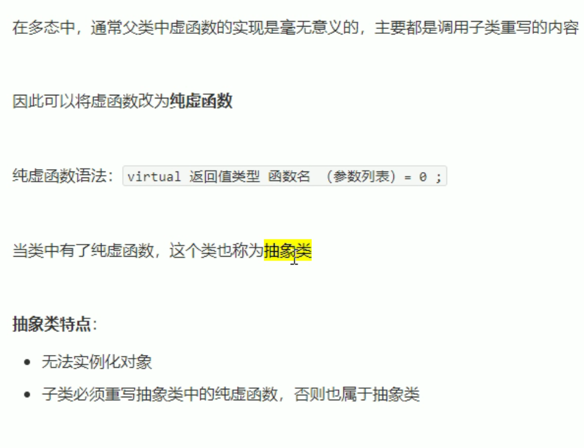

```cpp
#include <iostream>
using namespace std;

//纯虚函数和抽象类
class Base
{
public:
    //只要有一个纯虚函数，这个类就成为抽象类
    //抽象类特点：
    //1. 无法实例化对象
    //2. 抽象类的子类必须要重写父类中的纯虚函数，否则而也属于抽象类
    virtual void func()=0;
};

class Son:public Base
{
public:
    void func()
    {
        cout<<"func调用"<<endl;
    }
};


void test01()
{
    //Base base;//错误，抽象类无法实例化对象
    //new Base;//错误，抽象类无法实例化对象
    Base *base=new Son;//父类的指针或者引用 指向子类对象
    base->func();////func调用

    //Son *son=new Son;//一般不这么写，因为要满足父类的指针或者引用 指向子类对象
    //son->func();//func调用
}

int main()
{
    test01();
}
```

### 多态案例：制作饮品
```cpp
#include <iostream>
using namespace std;

class AbstractDrinking
{
public:
    //煮水
    virtual void Boil()=0;
    //冲泡
    virtual void Brew()=0;
    //倒入杯中
    virtual void PourInCup()=0;
    //加入辅料
    virtual void PutSomething()=0;
    //制作饮品
    void makeDrink()
    {
        Boil();
        Brew();
        PourInCup();
        PutSomething();
    }
};

//制作咖啡
class Coffee : public AbstractDrinking
{
public:
    //煮水
    virtual void Boil()
    {
        cout<<"煮农夫山泉"<<endl;
    }
    //冲泡
    virtual void Brew()
    {
        cout<<"冲泡咖啡"<<endl;
    }
    //倒入杯中
    virtual void PourInCup()
    {
        cout<<"倒入杯中"<<endl;
    }
    //加入辅料
    virtual void PutSomething()
    {
        cout<<"加入糖和牛奶"<<endl;
    }
};

//制作茶叶
class Tea : public AbstractDrinking
{
public:
    //煮水
    virtual void Boil()
    {
        cout<<"煮矿泉水"<<endl;
    }
    //冲泡
    virtual void Brew()
    {
        cout<<"冲泡茶叶"<<endl;
    }
    //倒入杯中
    virtual void PourInCup()
    {
        cout<<"倒入杯中"<<endl;
    }
    //加入辅料
    virtual void PutSomething()
    {
        cout<<"加入柠檬枸杞"<<endl;
    }
};

void doWork(AbstractDrinking *abs)
{
    abs->makeDrink();
    delete abs;
}

void test01()
{
    //制作咖啡
    doWork(new Coffee);
    /*
    煮农夫山泉
    冲泡咖啡
    倒入杯中
    加入糖和牛奶
    */
    cout<<"-------------------------"<<endl;
    //制作茶叶
    doWork(new Tea);
    /*
    煮矿泉水
    冲泡茶叶
    倒入杯中
    加入柠檬枸杞
    */
}

int main()
{
    test01();
}
```
输出：
```
煮农夫山泉
冲泡咖啡
倒入杯中
加入糖和牛奶
-------------------------
煮矿泉水
冲泡茶叶
倒入杯中
加入柠檬枸杞
```


不使用new的写法：
```cpp
#include <iostream>
using namespace std;

class AbstractDrinking
{
public:
    //煮水
    virtual void Boil()=0;
    //冲泡
    virtual void Brew()=0;
    //倒入杯中
    virtual void PourInCup()=0;
    //加入辅料
    virtual void PutSomething()=0;
    //制作饮品
    void makeDrink()
    {
        Boil();
        Brew();
        PourInCup();
        PutSomething();
    }
};

//制作咖啡
class Coffee : public AbstractDrinking
{
public:
    //煮水
    virtual void Boil()
    {
        cout<<"煮农夫山泉"<<endl;
    }
    //冲泡
    virtual void Brew()
    {
        cout<<"冲泡咖啡"<<endl;
    }
    //倒入杯中
    virtual void PourInCup()
    {
        cout<<"倒入杯中"<<endl;
    }
    //加入辅料
    virtual void PutSomething()
    {
        cout<<"加入糖和牛奶"<<endl;
    }
};

//制作茶叶
class Tea : public AbstractDrinking
{
public:
    //煮水
    virtual void Boil()
    {
        cout<<"煮矿泉水"<<endl;
    }
    //冲泡
    virtual void Brew()
    {
        cout<<"冲泡茶叶"<<endl;
    }
    //倒入杯中
    virtual void PourInCup()
    {
        cout<<"倒入杯中"<<endl;
    }
    //加入辅料
    virtual void PutSomething()
    {
        cout<<"加入柠檬枸杞"<<endl;
    }
};

void doWork(AbstractDrinking &abs)
{
    abs.makeDrink();
    //delete abs;
}

void test01()
{
    //制作咖啡
    Coffee coffee;
    doWork(coffee);
    /*
    煮农夫山泉
    冲泡咖啡
    倒入杯中
    加入糖和牛奶
    */
    Tea tea;
    doWork(tea);
}

int main()
{
    test01();
}
```

### 虚析构和纯虚析构
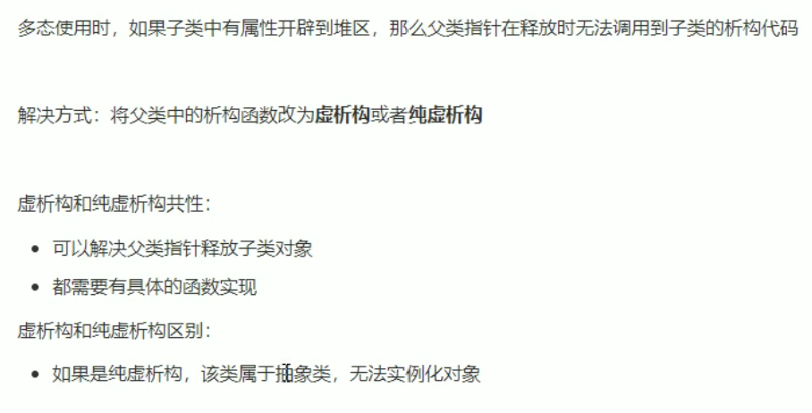

虚析构：父类的析构函数前加virtual
```cpp
#include <iostream>
#include <string>
using namespace std;

//虚析构和纯虚析构

class Animal
{
public:
    Animal()
    {
        cout<<"Animal构造函数调用"<<endl;
    }
    //虚析构，可以解决父类指针释放子类对象时不干净的问题
    virtual ~Animal()
    {
        cout<<"Animal析构函数调用"<<endl;
    }
 
    //纯虚函数
    virtual void speak()=0;
};

class Cat:public Animal
{
public:
    Cat(string name)
    {
        cout<<"Cat构造函数调用"<<endl;
        m_name=new string(name);
    }
    ~Cat()
    {
        if (m_name!=NULL)
        {
            cout<<"Cat析构函数调用"<<endl;
            delete m_name;
            m_name=NULL;
        }
    }
    virtual void speak()
    {
        cout<<*m_name<<"小猫在说话"<<endl;
    }
    string *m_name;//创建到堆区
};

void test01()
{
    Animal *animal=new Cat("Tom");
    animal->speak();//Tom小猫在说话
    delete animal;
}

int  main()
{
    test01();
}
```
纯虚析构：
```cpp
#include <iostream>
#include <string>
using namespace std;

//虚析构和纯虚析构

class Animal
{
public:
    Animal()
    {
        cout<<"Animal构造函数调用"<<endl;
    }
    // //虚析构，可以解决父类指针释放子类对象时不干净的问题
    // virtual ~Animal()
    // {
    //     cout<<"Animal析构函数调用"<<endl;
    // }

    //纯虚析构
    //纯虚析构，需要声明也需要实现
    //有了纯虚析构之后，这个类属于抽象类，无法实例化对象
    virtual ~Animal()=0;
 
    //纯虚函数
    virtual void speak()=0;
};

//纯虚析构，需要声明也需要实现
//有了纯虚析构之后，这个类属于抽象类，无法实例化对象
Animal::~Animal()
 {
     cout<<"纯虚析构函数调用"<<endl;
 }


class Cat:public Animal
{
public:
    Cat(string name)
    {
        cout<<"Cat构造函数调用"<<endl;
        m_name=new string(name);
    }
    ~Cat()
    {
        if (m_name!=NULL)
        {
            cout<<"Cat析构函数调用"<<endl;
            delete m_name;
            m_name=NULL;
        }
    }
    virtual void speak()
    {
        cout<<*m_name<<"小猫在说话"<<endl;
    }
    string *m_name;//创建到堆区
};

void test01()
{
    Animal *animal=new Cat("Tom");
    animal->speak();//Tom小猫在说话
    delete animal;
}

int  main()
{
    test01();
}
```

虚析构的语法：

`virtual ~类名(){}`

纯虚析构的语法：

`virtual ~类名()=0;`

`类名::~类名(){}`

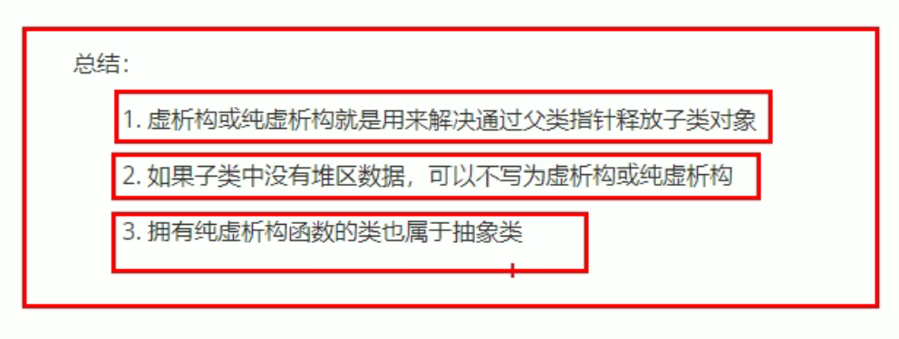


