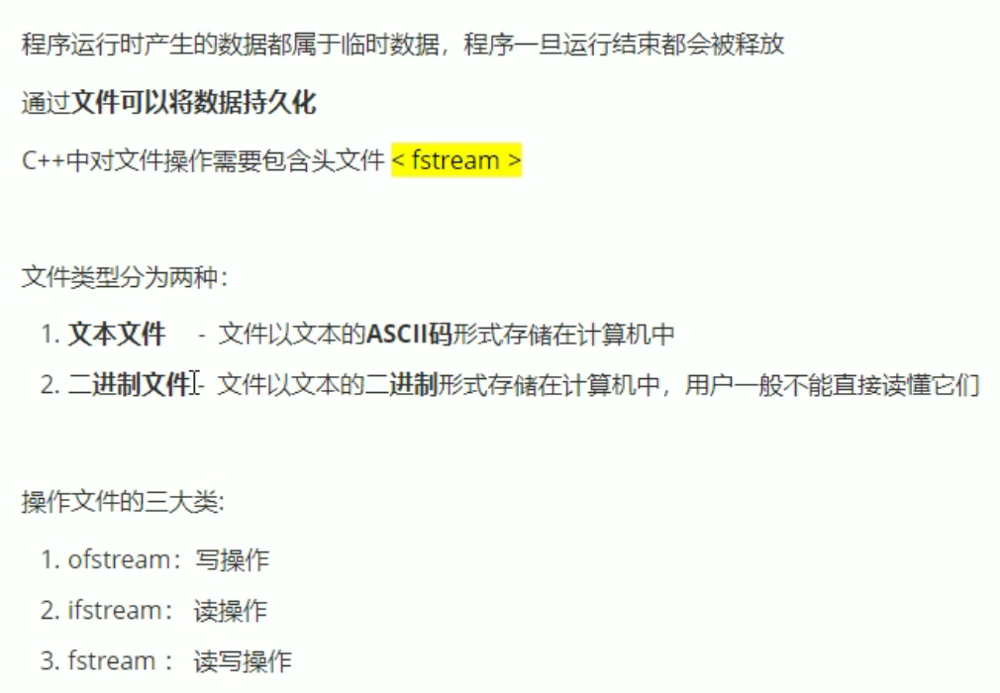
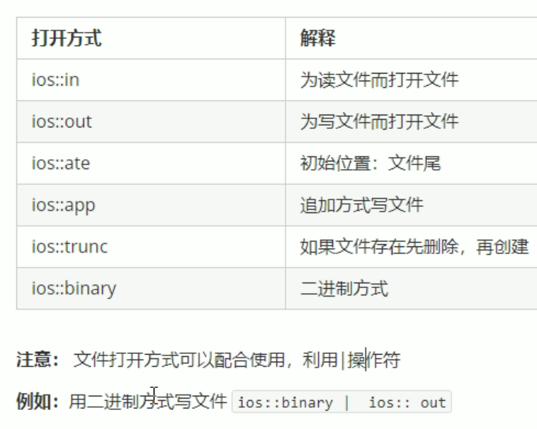
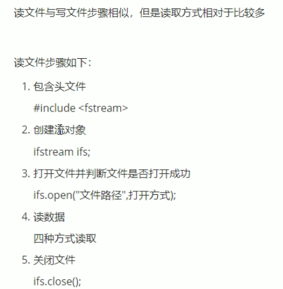
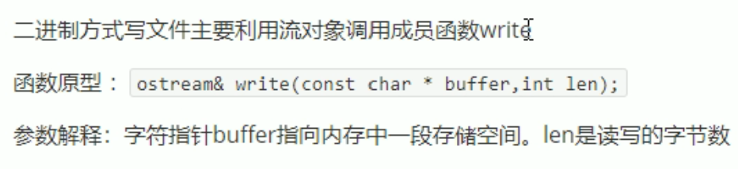
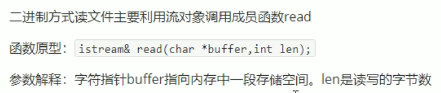

## 文本文件:写文件


文件打开方式：


```cpp
#include <iostream>
#include <fstream>
using namespace std;

void test01()
{
    ofstream ofs;
    ofs.open("test.txt",ios::out);
    ofs<<"姓名：张三"<<endl;
    ofs<<"姓名：dj "<<endl;
    ofs<<"姓名：jdhduduhhud低价"<<endl;
    ofs.close();
}

int main()
{
    test01();
}

```
## 文本文件：读文件


读取数据的4种方法:

```cpp
#include <iostream>
#include <fstream>
#include <string>
using namespace std;

void test01()
{
    ifstream ifs;
    ifs.open("test.txt",ios::in);
    if(!ifs.is_open())
    {
        cout<<"文件打开失败"<<endl;
        return;
    }

    //读取数据的4种方法
    //1.
    char buf[1024]={0};
    while(ifs>>buf)
    {
        cout<<buf<<endl;
    }

    //2.
    char buf1[1024]={0};
    while(ifs.getline(buf1, sizeof(buf1)))
    {
        cout<<buf1<<endl;
    }

    //3. 
    string buf3;
    while(getline(ifs,buf3))
    {
        cout<<buf3<<endl;
    }

    //4.
    char c;
    while((c=ifs.get())!=EOF)
    {
        cout<<c<<endl;
    }


    ifs.close();
}
int main()
{
    test01();
}
```

## 二进制文件：写文件

以二进制方式对文件进行读写操作，打开方式要指定为`ios::binary`



```cpp
#include <iostream>
#include <fstream>
using namespace std;

class Person
{
public:
    char m_name[64];//姓名
    int m_age; //年龄
};

void test01()
{
    ofstream ofs;
    ofs.open("person.txt",ios::out|ios::binary);
    Person p={"张三",18};
    ofs.write((const char*)&p,sizeof(Person));
    ofs.close();
}

int main()
{
    test01();
}
```
## 二进制文件：读文件


```cpp
#include <iostream>
#include <fstream>
using namespace std;

class Person
{
public:
    char m_name[64];
    int m_age;
};

void test01()
{
    ifstream ifs;
    ifs.open("person.txt",ios::in|ios::binary);
    if (!(ifs.is_open()))
    {
        cout<<"读取失败"<<endl;
        return;
    }
    Person p;
    ifs.read((char*)&p,sizeof(Person));
    cout<<"姓名："<<p.m_name<<"年龄："<<p.m_age<<endl;//姓名：张三年龄：18
    ifs.close();
}

int main()
{
    test01();
}
```