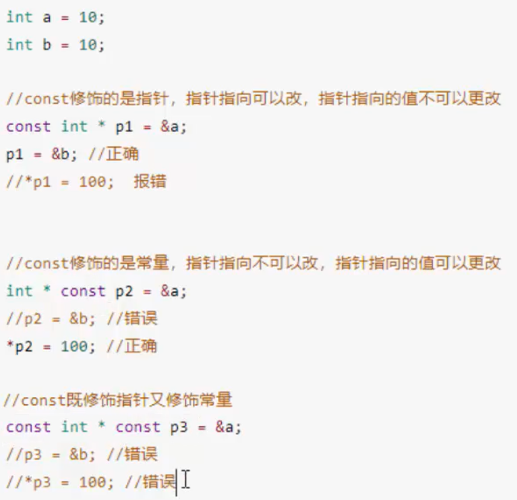

## 指针的定义和使用
```cpp
#include <iostream>
using namespace std;

int main()
{
    int a=10;
    int *p;
    p=&a;
    cout<<"a的地址："<<&a<<endl;//a的地址：0x61fe14
    cout<<"p="<<p<<endl;//p=0x61fe14
    cout<<"*p="<<*p<<endl;//*p=10
    *p=10000;
    cout<<"*p="<<*p<<endl;//*p=10000
}
```

## 指针所占内存空间
无论指针指向的是什么数据类型：

32位：占4个字节
64位：占8个字节

```cpp
#include <iostream>
using namespace std;

int main()
{
    cout<<"sizeof(int *)="<<sizeof(int *)<<endl;
    cout<<"sizeof(float *)="<<sizeof(float *)<<endl;
    cout<<"sizeof(double *)="<<sizeof(double *)<<endl;
    cout<<"sizeof(char *)="<<sizeof(char *)<<endl;
    cout<<"sizeof(long *)="<<sizeof(long *)<<endl;
    cout<<"sizeof(long long *)="<<sizeof(long long *)<<endl;
}
```
输出
```
sizeof(int *)=8        
sizeof(float *)=8      
sizeof(double *)=8     
sizeof(char *)=8       
sizeof(long *)=8       
sizeof(long long *)=8 
```

## 空指针
空指针：指针变量指向内存中编号为0的空间，用于初始化变量，空指针指向的内存是不可以访问的

0~255之间的内存编号是系统占用的，因此不可以访问

```cpp
#include <iostream>
using namespace std;

int main()
{
    int *p=NULL;//NULL:0
    *p=100;//非法！！

}
```
## 野指针
指针变量指向非法的内存空间

#include <iostream>
using namespace std;

int main()
{
    //定义了一个野指针
    int *p=(int*)0x1100;
    cout<<*p<<endl;//访问野指针出错，没权限
}

空指针和野指针都不是我们定义的

## const修饰指针
1. 常量指针: `const int *p=&a`;

指针的指向可以改，但指针指向的值不可以改

比如*p=20;这种是不可以的，p=&b;是可以的

2. 指针常量: `int * const p=&a`;

指针的指向不可以改，指针指向的值可以改

比如*p=20;是可以的，p=&b;是不可以的

区分：常量指针const后接数据类型(int)，指针常量const后接p


cosnt既修饰指针，也修饰常量：`const int * const p=&a;`

此时指针的指向和指针指向的值都不能修改



## 指针和数组
利用指针访问数组中的元素
```cpp
#include <iostream>
using namespace std;

int main()
{
    int arr[10]={0,1,2,3,4,5,6,7,8,9,};
    cout <<"第一个元素为："<<arr[0]<<endl;//第一个元素为：0
    int *p=arr;//arr就是数组首地址
    cout <<"利用指针访问第一个元素"<<*p<<endl;//利用指针访问第一个元素0

    p++;//指针向后偏移4个字节
    cout <<"利用指针访问第二个元素"<<*p<<endl;//利用指针访问第二个元素1
    
    //利用指针遍历数组
    int *p2=arr;
    for (int i=0;i<10;i++)
    {
        //cout<<arr[i]<<endl;
        cout<<*p2<<endl;
        p2++;
    }
}
```
## 指针和函数

值传递vs地址传递
```cpp
#include <iostream>
using namespace std;

//值传递
void swap0(int a,int b)
{
    int temp=a;
    a=b;
    b=temp;
}

//地址传递
void swap1(int *p1,int *p2)
{
    int temp=*p1;
    *p1=*p2;
    *p2=temp;
}

int main()
{
    int a=10,b=20;
    //值传递
    swap0(a,b);
    cout<<a<<b<<endl;//1020,未改变
    //地址传递
    swap1(&a,&b);
    cout<<a<<b<<endl;//2010，发生改变
}
```
## 指针+数组+函数案例
封装一个函数，利用冒泡排序，实现对整型数组的升序排列
```cpp
#include <iostream>
using namespace std;

//冒泡排序，参数1：数组首地址，参数2：数组长度
void bubbleSort(int *arr,int len)
{
    for (int i=0;i<len-1;i++)
    {
        for (int j=0;j<len-i-1;j++)
        {
            if (arr[j]>arr[j+1])
            {
                int temp=arr[j];
                arr[j]=arr[j+1];
                arr[j+1]=temp;
            }
        }
    }
}

void printArr(int *arr,int len)
{
    for(int i=0;i<len;i++)
    {
        cout<<arr[i]<<" ";
    }
}
int main()
{
    int arr[10]={1,2,5,3,9,8,7,10,11,6};
    int len=sizeof(arr)/sizeof(arr[0]);
    bubbleSort(arr,len);
    printArr(arr,len);//1 2 3 5 6 7 8 9 10 11
}
```